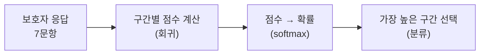
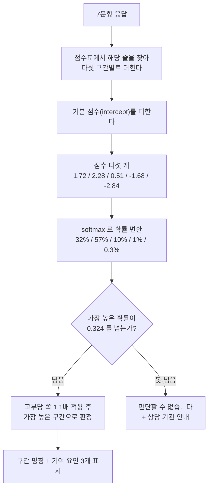

# 다항 로지스틱 회귀 — 우리 모델은 어떻게 판단하는가

> 발표용 설명 문서. 우리 서비스에 실제로 올라가 있는 모델(`v1.0.0`)의 **진짜 숫자**로 설명한다.
> 수식을 외울 필요 없이, 한 사람의 응답이 결과가 되기까지를 따라가면 된다.

---

## 1. 한 문장으로

> **문항마다 점수표가 있고, 보호자가 고른 답의 점수를 다섯 구간별로 더한 뒤, 가장 높은 구간을 답으로 낸다.**

끝이다. 나머지는 이 문장을 자세히 푼 것이다.

---

## 2. 왜 "회귀"인데 분류를 하나

이름이 헷갈린다. 정리하면 이렇다.

| | 하는 일 | 예 |
|---|---|---|
| 선형 회귀 | 숫자를 맞힌다 | 집값 3억 2천만 원 |
| 로지스틱 회귀 | **둘 중 하나**를 고른다 | 스팸인가 아닌가 |
| **다항 로지스틱 회귀** | **여럿 중 하나**를 고른다 | 다섯 구간 중 어디인가 |

"회귀"로 점수를 계산한 다음, 그 점수를 확률로 바꿔 고르는 방식이라 이름에 회귀가 남았다.

**우리는 다섯 구간 중 하나를 골라야 하므로 다항(multinomial)이다.**



---

## 3. 점수표가 어떻게 생겼나 — 실제 숫자

우리 모델의 **3번 문항** 점수표다. 학습으로 얻은 실제 값이다.

**"돌보고 계신 당사자에게 하루 중 어느 정도의 도움이 필요한가요?"**

| 보호자가 고른 답 | 최고부담 | 고부담 | 중간부담 | 저부담 | 부담없음 |
|---|---|---|---|---|---|
| 일과 대부분(12시간 이상) | **+0.690** | +0.434 | −0.309 | −0.202 | −0.612 |
| 하루 절반 정도 | +0.399 | +0.288 | −0.039 | −0.345 | −0.303 |
| 하루 몇 시간 정도 | +0.125 | +0.023 | +0.102 | +0.088 | −0.337 |
| 아주 잠깐이면 충분 | −0.542 | +0.009 | +0.321 | +0.134 | +0.077 |
| 도움이 필요하지 않음 | −0.652 | −0.707 | −0.036 | +0.309 | **+1.086** |

**표가 계단처럼 기울어 있다.**

- "12시간 이상 도움이 필요하다" → 최고부담에 **+0.690**, 부담없음에 **−0.612**
- "도움이 필요하지 않다" → 정반대로 최고부담에 −0.652, 부담없음에 **+1.086**

이 숫자를 사람이 정한 게 아니다. **2,398가구의 실제 응답과 실제 부담 수준을 보고 컴퓨터가 찾아낸 값**이다. 이것이 "학습"이다.

문항 7개에 이런 표가 하나씩 있다. 합쳐서 **53줄**이다.

```
1. 일과 만족도        6줄        5. 퇴사 이유       16줄
2. 가족 지지          6줄        6. 당사자와의 관계   8줄
3. 도움 필요 시간      5줄        7. 근로 의미 이해    4줄
4. 가구주 유형         8줄       ─────────────────────
                                 합계             53줄
```

---

## 4. 실제 한 사람을 따라가 보자

### 이 보호자가 답한 내용

```
1. 일과를 어떻게 느끼나          →  싫어하는 편
2. 취업에 대한 가족 지지          →  별로 지지하지 않음
3. 하루 중 필요한 도움           →  일과 대부분(12시간 이상)
4. 가구 생계를 책임지는 분        →  어머니
5. 마지막 일자리 퇴사 이유         →  해당사항 없음
6. 당사자와의 관계               →  어머니
7. 근로 의미 이해도              →  거의 이해하지 못한다
```

### 1단계 — 고른 답의 점수를 다섯 구간별로 더한다

| 문항 | 최고부담 | 고부담 | 중간부담 | 저부담 | 부담없음 |
|---|---|---|---|---|---|
| 1. 일과 만족도 | +0.101 | +0.011 | +0.090 | −0.330 | +0.128 |
| 2. 가족 지지 | −0.129 | +0.186 | −0.245 | +0.058 | +0.131 |
| **3. 도움 필요 시간** | **+0.690** | **+0.434** | −0.309 | −0.202 | −0.612 |
| 4. 가구주 유형 | +0.037 | +0.205 | +0.227 | +0.131 | −0.600 |
| 5. 퇴사 이유 | −0.129 | −0.159 | −0.061 | +0.102 | +0.247 |
| **6. 당사자와의 관계** | **+0.531** | +0.211 | −0.300 | −0.235 | −0.208 |
| 7. 근로 의미 이해 | +0.294 | +0.163 | +0.076 | −0.586 | +0.054 |
| **기본 점수** | +0.329 | **+1.232** | +1.034 | −0.617 | −1.978 |
| **합계** | **1.724** | **2.283** | 0.510 | −1.679 | −2.838 |

**"기본 점수"(intercept)** 는 아무 답도 안 봤을 때의 출발선이다. 고부담군이 `+1.232`로 가장 높은데, **학습 데이터에서 고부담군이 가장 많았기 때문**(38.9%)이다. 아무 정보가 없으면 흔한 쪽을 고르는 것이 합리적이다.

### 2단계 — 점수를 확률로 바꾼다 (softmax)

점수는 −2.8부터 +2.3까지 제멋대로다. 이걸 **합이 1이 되는 확률**로 바꾼다.

```
확률 = e^(그 구간 점수) ÷ (다섯 구간의 e^점수 합)
```

`e^x`를 쓰는 이유는 두 가지다 — **음수를 양수로 바꾸고**, **차이를 벌린다.**

| 구간 | 점수 | e^점수 | **확률** |
|---|---|---|---|
| 최고부담군 | 1.724 | 0.572 | **32.4%** |
| **고부담군** | **2.283** | **1.000** | **56.6%** |
| 중간부담군 | 0.510 | 0.170 | 9.6% |
| 저부담군 | −1.679 | 0.019 | 1.1% |
| 부담없음 | −2.838 | 0.006 | 0.3% |
| | | | **합계 100%** |

점수 차이는 1.724 vs 2.283으로 **0.56**뿐인데, 확률은 32% vs 57%로 벌어졌다. `e^x`의 효과다.

### 3단계 — 고부담 쪽에 살짝 무게를 준다

우리 서비스는 **부담이 큰 보호자를 놓치는 것을 가장 비싼 실수**로 본다. 그래서 1·2단계 확률에 **1.1배**를 곱한다.

| 구간 | 확률 | 가중치 | 가중 점수 |
|---|---|---|---|
| 최고부담군 | 0.324 | ×1.1 | 0.356 |
| **고부담군** | 0.566 | ×1.1 | **0.623** |
| 중간부담군 | 0.096 | ×1.0 | 0.096 |
| 저부담군 | 0.011 | ×1.0 | 0.011 |
| 부담없음 | 0.003 | ×1.0 | 0.003 |

이 1.1이라는 값도 사람이 정하지 않았다. **"고부담을 놓치는 비율을 일정 수준 이하로 유지하면서 전체 성능이 가장 좋은 값"** 을 규칙이 자동으로 찾았다.

### 4단계 — 판정

```
가장 높은 것       →  고부담군
확신도 (max 확률)  →  0.566
판정 불가 기준     →  0.324
                     0.566 > 0.324 이므로 판정한다

화면 표시 : "고부담군 — 돌봄 부담이 큰 상태로 보입니다"
```

만약 확신도가 0.324보다 낮았다면 **"판단할 수 없습니다"** 가 나온다. 전체의 약 3%가 여기 해당한다.

---

## 5. 전체 흐름 한 장



---

## 6. 왜 이 방법을 골랐나

세 가지 방법을 **같은 조건으로 붙여서** 골랐다.

| 알고리즘 | 성적(macro F1) | |
|---|---|---|
| **다항 로지스틱 회귀** | **0.318** | ✅ 채택 |
| 랜덤 포레스트 | 0.289 | |
| 엑스트라 트리 | 0.267 | |

**단순한 방법이 복잡한 방법을 이겼다.** 흔한 일은 아니다. 이유는 두 가지다.

- 학습 데이터가 **2,398건**뿐이다. 복잡한 모델은 이 정도 양에서 데이터를 외워버린다
- 나중에 `y`를 빼고 군집화해 확인한 결과, **이 데이터에는 복잡한 구조 자체가 없었다**

### 덤으로 얻은 것

로지스틱 회귀는 **점수표를 사람이 읽을 수 있다.** 그래서 결과 화면에 이렇게 쓸 수 있다.

> "하루 중 필요한 도움의 양에 대한 응답 — **일과 대부분(하루 12시간 이상)**"

어느 문항이 얼마나 판정을 밀었는지 표에서 바로 나온다. 위 사람은 3번 문항(+0.690)과 6번 문항(+0.531)이 최고부담 쪽을 가장 크게 밀었다.

트리 계열이었다면 이 설명을 만드는 데 별도의 복잡한 계산이 필요했을 것이다.

---

## 7. 발표할 때 쓸 세 문장

1. **"문항마다 점수표가 있고, 고른 답의 점수를 다섯 구간별로 더해 가장 높은 구간을 답으로 냅니다."**
2. **"점수표는 사람이 만든 게 아니라 2,398가구의 실제 데이터에서 컴퓨터가 찾아낸 것입니다."**
3. **"단순한 방법을 쓴 이유는, 데이터가 적을 때는 복잡한 모델이 오히려 지기 때문입니다. 실제로 붙여봤더니 그랬습니다."**

---

## 부록 — 자주 나오는 질문

**Q. 점수가 음수인 건 무슨 뜻인가**
그 구간일 **가능성을 낮춘다**는 뜻이다. "도움이 필요하지 않다"가 최고부담에 −0.652인 것은 자연스럽다.

**Q. 왜 답을 0/1 칸으로 펼치나 (원-핫)**
"가구주가 어머니(2)"와 "가구주가 형제자매(4)"는 크기 비교가 무의미하다. 그냥 숫자로 넣으면 컴퓨터가 "형제자매 > 어머니"로 읽는다. 칸을 따로 두면 그런 오해가 없다.

**Q. 답을 안 한 문항은 어떻게 되나**
"해당사항 없음"도 **하나의 칸**으로 둔다. 위 사람의 5번 문항이 그 경우이며 실제로 점수가 붙는다(부담없음 +0.247). 답을 안 한 것 자체가 정보다.

**Q. 정확도가 48%인데 쓸 만한가**
다섯 구간을 정확히 집어내는 건 어렵다. 하지만 **"지원이 필요한 사람인가"** 는 **69.6%** 정확도로 가려내고, 실제 고부담 보호자의 **77.3%** 를 잡아낸다. 서비스가 실제로 필요한 판단은 후자다.
