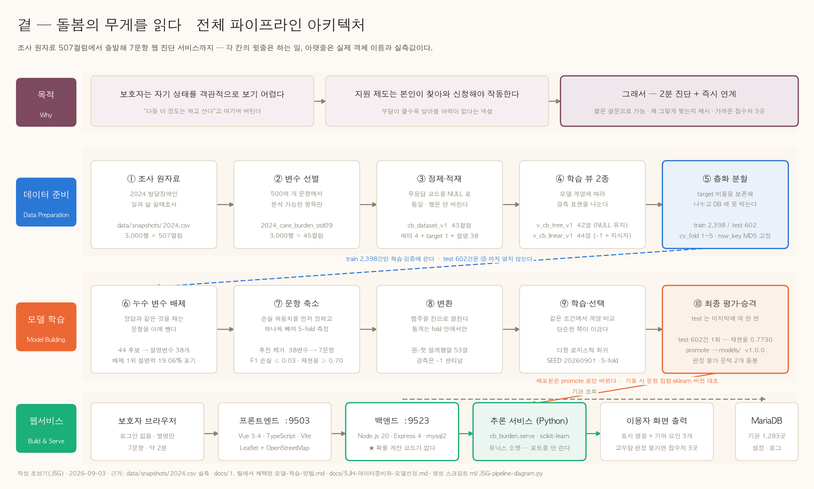

# 전체 파이프라인 아키텍처 — 목적 · 데이터 준비 · 모델 학습 · 웹서비스

**작성** 조성기 (JSG) · 2026-09-03 · ELI5 스킬로 눈높이 조정
**그림** `docs/JSG-전체-파이프라인-아키텍처.png` (발표·문서 삽입용) · `.pdf` (인쇄·벡터)
**생성 스크립트** `ml/JSG-pipeline-diagram.py` — 문구나 수치를 고쳐 다시 뽑을 수 있다

> **읽는 법** — 각 칸은 두 층이다.
> **윗줄**은 *무엇을 하는지* 쉬운 말로, **아랫줄**은 *실제 객체 이름과 실측값*이다.
> 쉬운 말만 있으면 추적이 안 되고, 이름만 있으면 처음 보는 사람이 못 읽는다.



---

## 0. 한 문장

**500개가 넘는 설문 원자료를 일곱 문항까지 줄여, 2분 만에 돌봄부담을 가늠하고
가까운 접수처를 안내하는 웹 서비스로 만들었다.**

---

## 1. 목적 — 왜 만드나

| | |
|---|---|
| 문제 ① | 보호자는 **자기 상태를 객관적으로 보기 어렵다.** "다들 이 정도는 하고 산다"고 여기며 버틴다 |
| 문제 ② | **지원 제도는 본인이 찾아와 신청해야 작동한다.** 부담이 클수록 알아볼 여력이 없다는 역설 |
| 해법 | **2분 진단 + 즉시 연계.** 짧은 설문으로 수준을 가늠하고, 왜 그렇게 봤는지 되짚어 주고, 부담이 크면 추가 조작 없이 가까운 접수처 3곳을 보여준다 |

---

## 2. 데이터 준비 — 507컬럼에서 시작한다

| 단계 | 하는 일 | 실제 객체와 실측값 |
|---|---|---|
| ① 조사 원자료 | 2024 발달장애인 일과 삶 실태조사 | `data/snapshots/2024.csv` — **3,000행 × 507컬럼** |
| ② 변수 선별 | 500여 개 문항에서 분석 가능한 항목만 골라낸다 | `2024_care_burden_std09` — **3,000행 × 45컬럼** |
| ③ 정제·적재 | 무응답 코드를 NULL 로 통일한다. **행은 한 건도 버리지 않는다** | `cb_dataset_v1` — **43컬럼** (메타 4 + target 1 + 설명변수 38) |
| ④ 학습 뷰 2종 | 모델 계열에 따라 결측 표현을 나눈다 | `v_cb_tree_v1` 42열 (NULL 유지) / `v_cb_linear_v1` 44열 (−1 + 결측 지시자 2개) |
| ⑤ 층화 분할 | target 비율을 보존해 나누고 **DB 컬럼에 못 박는다** | train **2,398** / test **602** · `cv_fold` 1~5 · `row_key`(행 내용 MD5) 순서 고정 |

**507이라는 숫자를 직접 확인했다.**

```bash
head -1 data/snapshots/2024.csv | awk -F',' '{print NF}'   # → 507
wc -l < data/snapshots/2024.csv                            # → 3001 (헤더 포함)
```

**⑤에서 왜 층화인가** — 5등급("부담 없음")이 전체 77건뿐이라, 무작위로 나누면 test 에
5건이 갈 수도 25건이 갈 수도 있다. 그러면 macro F1 이 이 한 구간 때문에 크게 흔들려
모델을 비교할 수 없게 된다.

> **지시하신 순서와 실제 순서에 차이가 하나 있습니다.**
> `docs/2. 학습테스트 데이터 뷰(view)와 분할 상태_설명.md` 는 **45컬럼을 DB 에 적재한 다음**
> 단계, 즉 위 표의 **④ 뷰 생성과 ⑤ 분할**을 다루는 문서입니다. 507 → 45 축소는 그 앞
> 단계라서 그림에서는 ②로 따로 두었습니다. (그 문서는 현재
> `docs/SJH-데이터준비와-모델선정.md` §1~§3 으로 통합돼 있고, 통합 과정에서 설명변수
> 37 → **38**, `v_cb_linear_v1` 43 → **44**열로 두 군데가 실측 정정되었습니다.)

---

## 3. 모델 학습 — 38변수에서 7문항으로

`docs/1. 팀에서 채택한 모델-학습-방법.md` 의 절차 그대로다.

| 단계 | 하는 일 | 실제 값 |
|---|---|---|
| ⑥ 누수 변수 배제 | **정답과 같은 것을 재는 문항을 아예 뺀다** (FR-004b) | 44 후보 → 설명변수 **38개**. 배제 1위는 단독 설명력 **19.06%** — 남은 최고치(8.23%)의 2.3배를 포기했다 |
| ⑦ 문항 축소 | 손실 허용치를 **먼저 정하고** 하나씩 빼며 5-fold 로 측정 | 후진 제거 38변수 → **7문항**. 정지 조건 F1 손실 ≤ 0.03 · 재현율 손실 ≤ 0.05 · 재현율 ≥ 0.70 |
| ⑧ 변환 | 범주를 칸으로 펼친다. **통계는 fold 학습 부분에서만** 계산 | 원-핫 설계행렬 **53열** · 결측은 −1 센티널(대치하지 않는다) |
| ⑨ 학습·선택 | 같은 조건에서 계열을 비교했더니 **단순한 쪽이 이겼다** | **다항 로지스틱 회귀** · `SEED = 20260901` · 층화 5-fold |
| ⑩ 최종 평가·승격 | test 는 **마지막에 딱 한 번** | test 602건 1회 — macro F1 **0.3416** · 고부담 재현율 **0.7730** · 판정 불가 **2.49%**. `promote` 로 `models/` 의 **v1.0.0** 이 된다 |

**문항 수를 먼저 정하지 않았다.** "30문항으로 하자" 같은 사전 결정 대신 **성능 손실
허용치를 정하고 문항 수를 결과로 얻었다.** 계획서의 30문항이 7문항이 된 경위가 여기다.

**train 과 test 의 경계** — ①~⑨ 의 모든 결정은 train 2,398건 안에서만 이뤄진다.
test 602건은 ⑩ 에서 단 한 번 열린다. 그림의 파란 점선이 그 경계다.

---

## 4. 웹서비스 — 판정은 한 곳에서만 한다

| 구성 | 역할 | 스택 |
|---|---|---|
| 보호자 브라우저 | 로그인 없음 · 별명만 · 7문항 약 2분 | — |
| 프론트엔드 `:9503` | 화면과 지도 | Vue 3.4 · TypeScript · Vite · Leaflet + OpenStreetMap (API 키 불필요) |
| 백엔드 `:9523` | 요청 중계 · 기관 조회 · 정책 값 주입 | Node.js 20 · Express 4 · mysql2 — **★ 확률 계산 코드가 없다** |
| 추론 서비스 | 실제 판정 | Python 3.11 · `cb_burden.serve` · scikit-learn — **유닉스 소켓, 포트를 쓰지 않는다** |
| MariaDB | 기관 1,283곳 · 설정 · 이벤트 로그 | MariaDB 12.1.2 — 개인 식별 정보 컬럼 자체가 없다 |

**빌드·배포에서 지키는 것 두 가지**

1. **배포본은 `promote` 로만 바뀐다.** 학습은 `models/runs/` 에만 쓰고, 승격 명령을
   거쳐야 서비스가 보는 릴리스가 교체된다.
2. **기동할 때 대조한다.** 백엔드와 추론 서비스의 **문항 집합**이 다르거나
   모델을 만든 **sklearn 버전**과 읽는 버전이 다르면 **백엔드가 아예 뜨지 않는다.**
   조용히 틀린 판정이 나가는 것보다 안 뜨는 편이 낫다는 판단이다.

**실패해도 안전한 쪽으로 넘어진다** — 추론 서비스가 응답하지 않으면 판정은 나오지
않지만 **기관 안내 3곳은 그대로 나간다**(FR-021j).

---

## 5. 그림에 넣지 않은 갈래 하나 — 원본 507컬럼 군집화

신지현이 2026-09-02 저녁에 **원본 507컬럼으로 군집화를 다시 했다**
(`docs/SJH-군집화-원본데이터.md`). 서빙 경로가 아니라 분석 갈래라 그림에서는 뺐지만,
**결론이 뒤집힌 중요한 결과**라 여기 적어 둔다.

| | 이전 (38변수 · `notebooks/HG-실험-군집화.ipynb`) | 이후 (원본 507 → 190변수) |
|---|---|---|
| 실루엣 | 0.1233 | **0.1179** |
| 판정 | 0.25 미만 → **"구조 없음"** | **널 베이스라인 0.0043 대비 27배 · p=0.000 → "구조 있다"** |
| 최적 k | 2 | **3** — 세 군집이 부담과 **단조 정렬**(고부담 리프트 0.54 / 1.03 / 1.45) |

같은 0.12 를 놓고 판정이 갈렸다. **차이는 방법이 아니라 비교 대상을 만든 것**이다.
0.25 라는 기준은 저차원 연속 데이터용 관례표이고 고차원 혼합형에는 그대로 댈 수 없다.

> **발표자료에 영향이 있다.** 현재 슬라이드 5 "정확도 48%는 모델 탓이 아니다" 는
> 옛 판정(구조 없음)을 근거로 쓰고 있다. 발표 전에 어느 쪽으로 말할지 정해야 한다.
> 상세는 `docs/JSG-발표자료-방법론대조-수정정리.md` §M5 와 함께 검토하는 것을 권한다.

---

## 6. 결과 파일 경로

| 파일 | 절대 경로 | 용도 |
|---|---|---|
| 다이어그램 (PNG) | `/Users/pioneer3/project2608/docs/JSG-전체-파이프라인-아키텍처.png` | 슬라이드·문서 삽입 (3,259 × 1,960px) |
| 다이어그램 (PDF) | `/Users/pioneer3/project2608/docs/JSG-전체-파이프라인-아키텍처.pdf` | 인쇄·확대 (벡터, 폰트 임베드) |
| 이 설명 문서 | `/Users/pioneer3/project2608/docs/JSG-전체-파이프라인-아키텍처.md` | 그림의 근거와 수치 |
| 생성 스크립트 | `/Users/pioneer3/project2608/ml/JSG-pipeline-diagram.py` | 다시 뽑을 때 |

```bash
PYTHONPATH=ml/.pylibs python3 ml/JSG-pipeline-diagram.py
```

읽기 전용이다 — DB · `models/` · 실행 중인 서비스를 건드리지 않는다.

## 7. 근거 문서

- `docs/1. 팀에서 채택한 모델-학습-방법.md` — 학습 절차·분할·문항 선별·test 평가
- `docs/2. 학습테스트 데이터 뷰(view)와 분할 상태_설명.md` — 뷰 2종과 분할 (통합 안내)
- `docs/SJH-데이터준비와-모델선정.md` — 위 문서의 통합본 · 실측 정정 4건
- `docs/SJH-군집화-원본데이터.md` — 원본 507컬럼 군집화
- `docs/HG_모델-동작시험-기록.md` · `docs/HG_추론경로-연결확인.md` — 서비스 실측
- `data/snapshots/2024.csv` — 원자료 (507컬럼 직접 확인)
