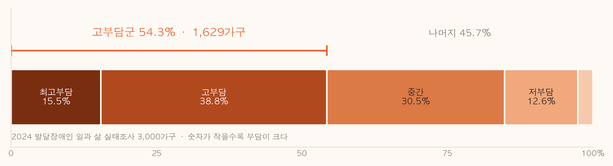
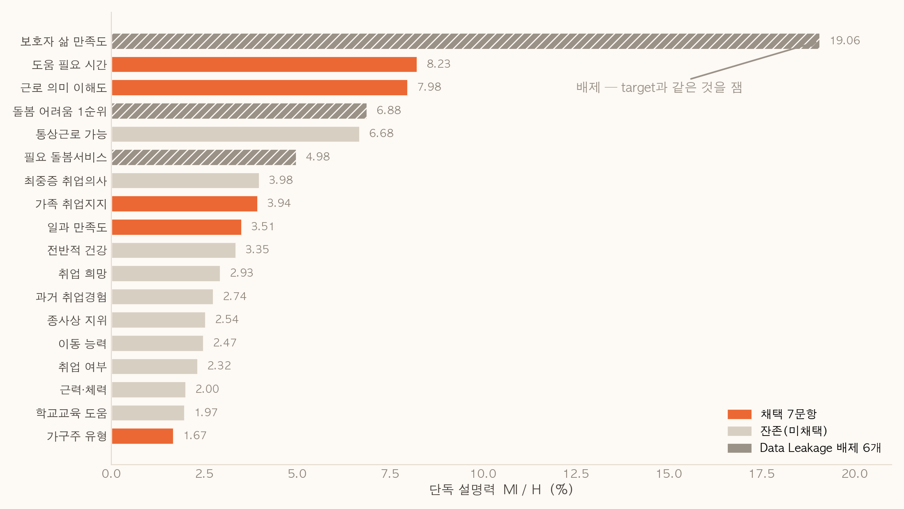
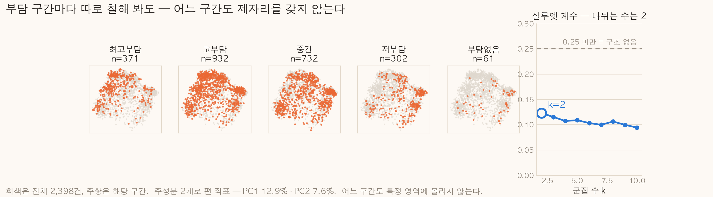
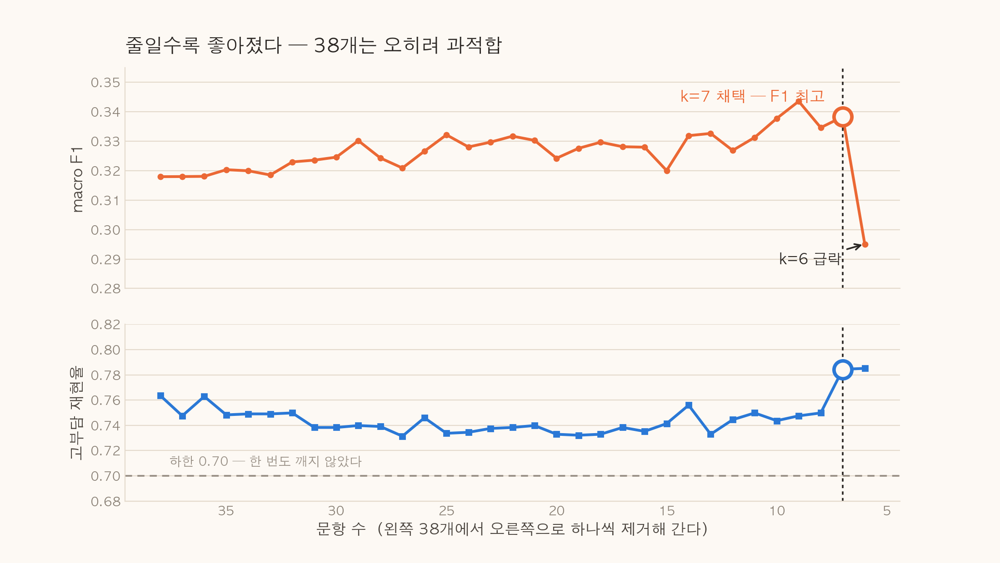
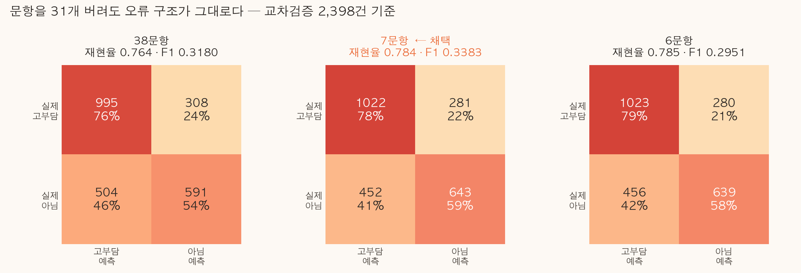
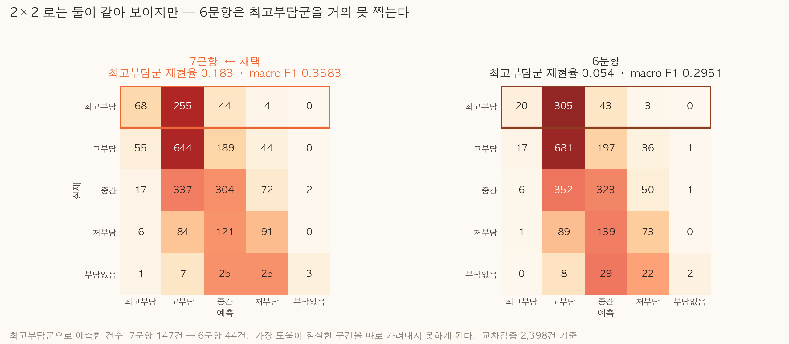
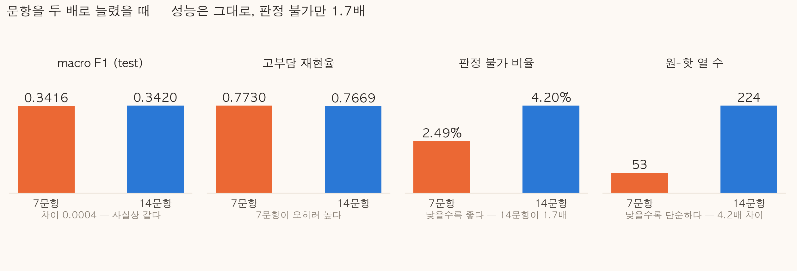
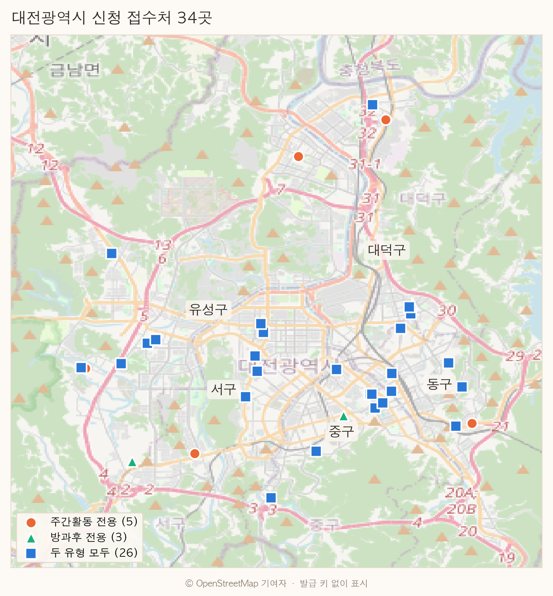
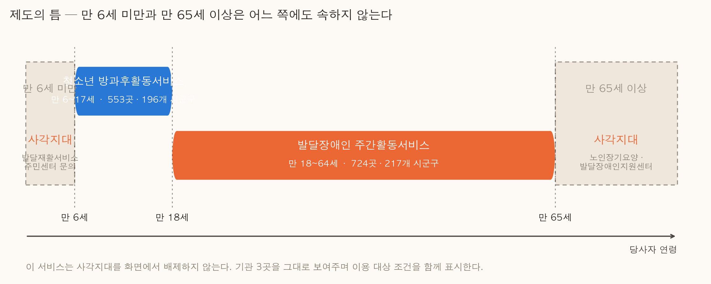

# 곁 — 돌봄의 무게를 읽다

**발달장애인 보호자 돌봄부담 경량 진단 및 복지서비스 연계 서비스**

Pioneer 3 팀 · 2026-09-01 · https://p3.sumzip.com

> 이 문서의 모든 수치는 `notebooks/` 의 실행 결과와 `docs/` 의 분석 문서에서 가져온 실측값이다.
> 재현: `notebooks/HG-모델-성능-리포트.ipynb` · `notebooks/HG-실험-군집화.ipynb` · `notebooks/HG-EDA-7문항.ipynb`

---

## 1. 왜 만들었나

발달장애인 보호자의 돌봄부담은 **본인도 자기 상태를 객관적으로 보기 어렵다.**
"다들 이 정도는 하고 산다"고 여기며 버티다 한계에 다다르는 경우가 많다.

그런데 지원 제도는 **본인이 찾아와 신청해야** 작동한다. 부담이 클수록 알아볼 여력이 없다는
역설이 있다.

**이 서비스가 하려는 것**

| | |
|---|---|
| 짧은 설문으로 | 지금의 돌봄부담이 어느 수준인지 **가늠할 근거**를 준다 |
| 판단 근거를 함께 | "왜 그렇게 봤는지"를 응답으로 되짚어 준다 |
| 즉시 연결 | 부담이 크면 **추가 조작 없이** 가까운 신청 접수처 3곳을 보여준다 |

로그인이 없다. 이름도 연락처도 받지 않는다.

---

## 2. 데이터 — 2024 발달장애인 일과 삶 실태조사

### 2.1 규모

| 항목 | 값 |
|---|---|
| 응답 가구 | **3,000가구** (전국 대표 표본) |
| 정제 후 설명변수 | **38개** (원 44개 중 6개 배제) |
| 예측 대상 | 돌봄부담 **5단계** (원 문항 I13) |
| 분할 | train 2,398 / test 602 (층화, 오차 최대 0.16%p) |

### 2.2 돌봄부담 분포 — 절반이 넘는 가구가 고부담



| 단계 | 의미 | 건수 | 비율 |
|---|---|---:|---:|
| 1 | 최고부담 | 464 | 15.5% |
| 2 | 고부담 | 1,165 | 38.8% |
| 3 | 중간 | 916 | 30.5% |
| 4 | 저부담 | 378 | 12.6% |
| 5 | 부담 없음 | 77 | **2.6%** |

> **고부담(1~2단계)이 1,629가구, 54.3%다.** 절반이 넘는다.
> 반대로 "부담 없음"은 77건뿐이다. **돌봄부담은 예외가 아니라 기본값에 가깝다.**

**척도 주의** — 이 데이터는 **숫자가 작을수록 부담이 크다.** 1이 최고부담, 5가 부담 없음이다.
방향을 반대로 읽기 쉬워 서비스 전 구간에서 표시 명칭으로만 노출한다.

### 2.3 정답이 새는 변수 6개를 일부러 버렸다

예측 대상(I13 돌봄부담)과 **같은 설문 블록**에 있거나 **같은 것을 재는** 변수들이다.

| 원 문항 | 변수 | 단독 설명력 | 왜 버렸나 |
|---|---|---:|---|
| **I14** | 보호자 삶 만족도 | **19.06%** | target과 같은 구성개념 |
| I10 | 돌봄 어려움 1순위 | 6.88% | 부담을 전제하고 원인을 물음 |
| I12_1 | 필요 돌봄서비스 유형 | 4.98% | 부담 판단의 **결과** |
| I11_H · I11 · I12 | 돌봄 공백·제도 인지 | 1.1 / 0.6 / 0.4% | target과 같은 I 블록 |



**버린 것 중 1위가 19.06%로, 남은 38개 중 최고(8.23%)의 2.3배다.**

넣으면 성적은 확실히 오른다. 그런데 **"보호자 삶 만족도로 보호자 돌봄부담을 예측"** 하는 것은
동어반복이다. 진단 도구로서 아무 의미가 없어진다.

> **성능을 포기하고 도구로서의 의미를 택했다.** 이 결정이 이후 모든 성능 수치의 전제다.

### 2.4 상식과 반대인 관측 — 보조 돌봄제공자 역설

`secondary_caregiver_type = 9`(보조 돌봄제공자 **없음**)로 나눠 보면,

| 그룹 | 표본 | 고부담(1~2) 비율 |
|---|---:|---:|
| 보조 제공자 **없음** | 410 | 51.2% |
| 보조 제공자 **있음** | 1,988 | **55.0%** |

**도와주는 사람이 있는 쪽의 부담이 오히려 3.8%p 높다.**

역인과로 보는 것이 자연스럽다. 부담이 큰 가구일수록 보조 제공자가 **투입되는** 것이지,
없어서 부담이 커지는 것이 아니다. 이 변수는 부담의 원인이 아니라 **결과**에 가깝다.

> 이 관측이 결과 화면 문구 설계를 바꿨다. 기여 요인을 인과가 아니라
> **동반 관찰 표현**으로 쓰기로 했다.

### 2.5 결측은 누락이 아니라 "해당 없음"이다

38개 중 14개에 결측이 있는데, 값이 **뭉친다.**

```
88.1%  퇴사 당시 계속근무 희망 · 마지막 일자리 퇴사 이유 · 과거 일자리 개수
69.8%  종사상 지위
30.2%  과거 취업 경험 · 당사자 취업 희망
```

같은 비율로 묶이는 것은 **같은 분기 조건을 공유**하기 때문이다. 취업 경험이 없으면
퇴사 이유를 묻지 않는다. 즉 이 결측은 데이터가 빠진 게 아니라 **"해당 없음"이라는 정보**다.

→ 결측을 채우지 않고 `-1`로 넣는다. 설문에서도 숨기지 않고 **"해당사항 없음" 선택지**로 받는다.

---

## 3. 분석 결과 — 왜 이 정도 정확도가 한계인가

### 3.1 군집화로 확인한 것

**정답(y)을 빼고** 38개 설명변수만으로 군집을 찾아봤다.

| 지표 | 값 | 해석 |
|---|---|---|
| 실루엣 계수 최고 | **0.1233** (k=2) | 0.25 미만 = 뚜렷한 군집 구조 없음 |
| 부담 구간과의 일치도 (ARI) | **0.027** | 0에 붙음 = 거의 무관 |
| PCA 1번 성분 설명력 | **12.9%** | 데이터를 관통하는 축이 없음 |



> **설명변수가 돌봄부담을 5구간으로 가를 만큼의 정보를 담고 있지 않다.**
> 알고리즘을 바꿔도 크게 오르지 않는다. **정확도 48%는 모델 탓이 아니라 데이터의 성질이다.**

그리고 하나 더 — **데이터가 자연스럽게 나뉘는 수는 2다.** 5구간이 아니다.
공교롭게도 이 서비스가 실제로 답해야 하는 질문도 **"고부담이냐 아니냐"** 다.

### 3.2 모델 계열 비교 — 세 후보를 같은 조건에서

38변수 전체, 같은 5-fold, 같은 지표로 붙였다.

| 계열 | macro F1 | 고부담 재현율 | |
|---|---:|---:|---|
| **다항 로지스틱 회귀** | **0.3180** | **0.7636** | ✅ 채택 |
| 랜덤 포레스트 | 0.2894 | 0.7552 | |
| 엑스트라 트리 | 0.2668 | 0.7544 | |

트리 계열이 진 이유는 **데이터 규모**에 있다. 3,000건에 5개 클래스, 그중 "부담 없음"은
61건뿐이다. 상호작용을 배우기엔 표본이 얇아 단순한 모델이 과적합을 덜 한다.

**부수 효과가 컸다** — 로지스틱에서는 기여 요인이 근사가 아니라 **정확히 분해된다.**
"왜 이 판정인가"를 산술적으로 닫힌 형태로 설명할 수 있다.

---

## 4. 설문 문항을 7개로 정한 기준

### 4.1 단독 설명력 순위로 자르지 않았다

변수 하나씩의 설명력(MI/H)은 이렇게 분포한다.

```
8.23%  도움 필요 시간          ← 1위
7.98%  근로 의미 이해도
6.68%  통상근로 가능 여부
...
1% 이상 21개 · 1% 미만 17개
```

**그런데 이 순위로 자르지 않았다.** 단독 지표는 **변수 간 중복을 반영하지 못하기** 때문이다.
예를 들어 `취업 여부`(2.32%)와 `종사상 지위`(2.54%)는 상당 부분 같은 정보인데,
순위로 자르면 둘 다 살아남는다.

### 4.2 실제로 쓴 기준 — 후진 제거

```
1. 38개 전체로 기준 모델을 만든다               → 기준선 확정
2. 가장 덜 기여하는 변수를 하나씩 뺀다
3. 뺄 때마다 5-fold 교차검증으로 성능을 잰다
4. 아래 조건을 깨는 순간 멈춘다
      macro F1 손실 ≤ 0.03
      고부담 재현율 손실 ≤ 0.05
      고부담 재현율 ≥ 0.70
5. 조건을 만족하는 가장 작은 집합을 채택한다
```

**핵심은 "성능 손실 허용치"를 먼저 정하고 문항 수를 결과로 얻었다는 점이다.**
"30문항으로 하자" 같은 사전 결정을 하지 않았다.

### 4.3 줄일수록 좋아졌다



| 문항 수 | macro F1 | 고부담 재현율 |
|---:|---:|---:|
| 38 | 0.3180 | 0.7636 |
| 20 | 0.3242 | 0.7329 |
| 10 | 0.3377 | 0.7437 |
| **7** | **0.3383** | **0.7843** |
| 6 | 0.2951 | 0.7851 ← F1 급락, 정지 |

**38개를 다 쓰면 오히려 과적합이었다.** k=6에서 성능이 무너져 **7개에서 멈췄다.**

### 4.4 혼동행렬로 본 선정 근거

선정 기준 자체는 위의 정지 조건이다. 그런데 **그 기준이 옳았는지**는 혼동행렬이 답한다.



**38 → 7: 31개를 버렸는데 오류 구조가 그대로다.** 고부담 재현율은 오히려 0.764 → 0.784로 올랐다.
버린 31개가 실제로는 기여하지 않았다는 뜻이다.

그런데 **2×2로만 보면 6문항도 멀쩡해 보인다.** 재현율 0.785로 7문항보다도 높다.
왜 6에서 멈췄는지는 5구간으로 봐야 드러난다.



| | 7문항 | 6문항 |
|---|---:|---:|
| 최고부담군 재현율 | **0.183** | **0.054** |
| 최고부담군으로 예측한 건수 | 147 | **44** |

**6문항이 되면 최고부담군을 사실상 못 찍는다.** 68건 → 20건으로 무너진다.
전체 정확도는 0.463 → 0.458로 거의 같은데, **가장 도움이 절실한 구간을 따로 가려내는 능력**만
사라진다. 이것이 k=7에서 멈춘 실질적인 이유다.

> 문항 수를 정한 것은 정지 조건이지만, **그 조건이 옳았음을 보여주는 것은 혼동행렬이다.**

*(모든 혼동행렬은 교차검증 2,398건 기준. test 602건은 "단 한 번만 사용" 규칙이 있어 k별로 열지 않았다.)*

### 4.5 채택된 7문항

| # | 원 문항 | 질문 | 단독 설명력 |
|---|---|---|---:|
| 1 | G8 | 당사자는 요즘 하루하루의 일과를 어떻게 느끼고 있나요? | 3.51% |
| 2 | F5 | 당사자의 취업에 대해 가족들이 어느 정도 지지하고 있나요? | 3.94% |
| 3 | G6 | 하루 중 어느 정도의 도움이 필요한가요? | **8.23%** |
| 4 | I4 | 가구의 생계를 주로 책임지는 분은 누구인가요? | 1.67% |
| 5 | E4 | 마지막 일자리를 그만둔 가장 큰 이유는? | 1.15% |
| 6 | A1 | 응답하시는 분은 당사자와 어떤 관계인가요? | 1.18% |
| 7 | F1 | "일을 한다"는 것의 의미를 어느 정도 이해하나요? | 7.98% |

**단독 1·2위(G6·F1)는 살아남았지만 3위(통상근로 가능 여부)는 탈락했다.**
F1(근로 의미 이해도)과 정보가 겹쳤기 때문이다. 후진 제거가 중복을 걸러낸 결과다.

**먼저 버려진 것들** — 취업 여부, 보호자 취업 상태, 운동 여부, 성별, 조기 노화 여부.
설명력이 낮거나 다른 변수와 겹쳤다.

### 4.6 문항을 14개로 늘려 봤다가 되돌렸다

7문항으로 "고부담군입니다"라고 하면 **보호자가 신뢰하기 어렵다**는 판단이 있어 실험했다.

| | 7문항 | 14문항 |
|---|---:|---:|
| macro F1 (test) | 0.3416 | 0.3420 |
| 고부담 재현율 (test) | **0.7730** | 0.7669 |
| **판정 불가 비율** | **2.49%** | **4.20%** |
| 원-핫 열 수 | 53 | 224 |



**성능은 사실상 같은데 판정 불가만 1.7배 늘었다.**

원인은 나이 변수였다. 14문항에 들어온 `보호자 나이`는 **한 살 단위 78개 범주**라,
"57세"인 사람은 학습 데이터의 1.3%뿐이다. 희소한 조합으로 분류되어 판정 불가가 된다.

> 문항을 두 배로 늘려 **응답 부담은 늘리고, 결과를 못 받는 사람도 늘렸으며, 정확도는 얻지 못했다.**
> → **7문항으로 복귀했다.**

---

## 5. 진단 성능 — 무엇을 할 수 있고 무엇을 못 하나

### 5.1 5구간을 정확히 맞히지는 못한다

**정확도 47.8%** (무작위 20%, 최빈값 찍기 38.7%)

| 구간 | 재현율 | 표본 |
|---|---:|---:|
| 최고부담군 | 0.258 | 93 |
| 고부담군 | 0.665 | 233 |
| 중간부담군 | 0.484 | 184 |
| 저부담군 | 0.263 | 76 |
| 부담없음 | **0.000** | 16 |

### 5.2 그러나 "지원이 필요한가"는 가려낸다

1~2단계를 하나로 묶으면 그림이 달라진다.

| test 602건 | 재현율 | 정밀도 | 정확도 |
|---|---:|---:|---:|
| 고부담 여부 2분류 | **0.773** | 0.695 | 0.696 |

**실제 고부담 보호자의 77.3%를 잡아낸다.**

### 5.3 위험한 실수가 없다

test 602건 혼동행렬에서 **실제 최고부담·고부담인 사람을 "부담 없음"으로 판정한 경우는 0건**이다.
가장 비싼 오류 — 도움이 절실한 사람을 그냥 돌려보내는 것 — 는 일어나지 않았다.

**설계로 만든 결과다.** 판정 시 1·2단계 확률에 1.1배를 곱한다. 이 값은 사람이 고른 것이 아니라
"재현율 0.73 이상 중 macro F1 최대"라는 규칙이 자동으로 찾았다.

### 5.4 모를 때는 모른다고 한다

응답 조합이 학습 데이터에서 드물거나 어느 구간도 확신할 수 없으면 **"판정 불가"** 를 낸다
(test 기준 2.5%).

이때는 부담 구간도 기여 요인도 보여주지 않는다. **대신 기관 안내는 그대로 한다** —
고부담일 가능성을 배제할 수 없기 때문이다. 안전망이다.

---

## 6. 우리나라 발달장애인 돌봄 서비스

### 6.1 이 서비스가 안내하는 두 제도

기관 데이터에 실제로 존재하는 것만 안내한다.

| 제도 | 대상 | 기관 수 | 시군구 |
|---|---|---:|---:|
| **발달장애인 주간활동서비스** | 만 18~64세 성인 | 724 | 217 |
| **청소년 발달장애인 방과후활동서비스** | 만 6~17세 청소년 | 553 | 196 |

**주간활동서비스** — 성인 발달장애인이 낮 시간에 지역사회에서 활동하도록 지원한다.
보호자에게는 **낮 시간의 돌봄 공백을 메워 주는 유일한 제도**에 가깝다.

**청소년 방과후활동서비스** — 학령기 발달장애 청소년의 방과 후 시간을 지원한다.
학교가 끝난 뒤부터 보호자 퇴근까지의 공백을 다룬다.

### 6.2 대전광역시 — 신청 접수처 34곳



| 구 | 기관 |
|---|---:|
| 중구 | 8 |
| 유성구 | 8 |
| 동구 | 7 |
| 서구 | 6 |
| 대덕구 | 5 |

34곳 중 **26곳이 두 유형을 모두 제공**한다. 주간활동 전용 5곳, 방과후 전용 3곳이다.
지도는 발급 키 없이 OpenStreetMap 으로 표시한다(JSG-01 반영).

### 6.3 전국 커버리지 — 229개 시군구 중 221개

| | |
|---|---|
| 전체 기초자치단체 | **229개** |
| 기관 데이터 확보 | **221개 (96.5%)** |
| 미확보 | **8개** — 대구 군위군, 인천 강화군·옹진군, 경기 오산시·가평군, 전남 장성군, 경북 고령군·울릉군 |

미확보 지역은 빈 지도를 보여주지 않고 **"정보 준비 중"과 광역 대표 문의처**를 안내한다.

**유형별로도 차이가 있다.** 주간활동은 217개 시군구에 있지만 방과후활동은 196개다.
**만 18세 미만 이용자는 33개 시군구에서 안내가 빌 수 있다.**

### 6.4 제도의 사각지대



연령이 두 제도의 범위를 벗어나는 구간이 있다.

| 연령 | 상황 | 이 서비스의 처리 |
|---|---|---|
| **만 6세 미만** | 두 제도 모두 대상 아님 | 발달재활서비스 — 주민센터 문의 안내 |
| 만 6~17세 | 방과후활동 | 정상 안내 |
| 만 18~64세 | 주간활동 | 정상 안내 |
| **만 65세 이상** | 장애인 서비스와 노인 서비스 **사이** | 노인장기요양보험·지역 발달장애인지원센터 안내 |

> **만 65세 이상 발달장애인은 제도의 틈에 놓인다.** 장애인 서비스에서는 나이가 많고
> 노인 서비스에서는 발달장애 특성이 고려되지 않는다.
> **이 서비스의 목적이 사각지대 발굴이므로 화면에서 배제하지 않고, 기관 3곳을 그대로
> 보여주면서 이용 대상 조건을 함께 표시한다.**

**연령 매핑은 자격 판정이 아니다.** 지자체 자체 사업이나 예외 운영이 있을 수 있어,
시스템의 역할은 조건을 알리는 데까지다.

*(제도 기준의 현행 유효성 — 특히 주간활동 만 65세 상한 — 은 복지 도메인 담당자 검토가 필요하다.)*

---

## 7. 설문으로 돌봄부담을 진단하는 의미

### 7.1 정확한 진단이 아니라 "말 걸기"다

정확도 48%다. 이것으로 "당신은 3단계입니다"라고 단정할 수 없고, 그렇게 하지도 않는다.

**그런데 이 서비스가 실제로 하는 일은 등급 매기기가 아니다.**

| 하는 것 | 하지 않는 것 |
|---|---|
| 지금 상태를 **가늠할 근거**를 준다 | 공식 자격을 판정한다 |
| "왜 그렇게 봤는지"를 **응답으로 되짚어** 준다 | 확신을 준다 |
| 부담이 크면 **기관으로 연결**한다 | 서비스 신청을 대신한다 |
| 모를 때는 **모른다고 한다** | 억지로 답을 낸다 |

### 7.2 7문항이 하는 진짜 역할

**① 자기 상태를 객관화하는 계기**
"다들 이 정도"라고 여기던 것이 전국 조사에서 어디쯤인지 보인다.
결과 화면은 3,000가구 분포와 비교해 "같은 응답을 한 보호자가 몇 %인지" 알려준다.

**② 제도로 가는 최단 경로**
고부담으로 판정되면 **추가 조작 없이** 가까운 접수처 3곳이 바로 나온다.
부담이 클수록 알아볼 여력이 없다는 역설을 겨냥한 설계다.

**③ 2분 안에 끝난다**
7문항이다. 부담이 큰 사람이 끝까지 갈 수 있는 분량이어야 의미가 있다.
문항을 14개로 늘렸다가 되돌린 이유이기도 하다.

### 7.3 왜 "부담 없음"을 못 맞혀도 괜찮은가

test에서 "부담 없음" 16건을 하나도 맞히지 못했다. 그런데 **이 서비스에서 그 구간은
개입 대상이 아니다.** 학습 데이터에서도 2.6%뿐이다.

**놓치면 안 되는 것은 반대쪽이다.** 그리고 실제 고부담 보호자의 77.3%를 잡아내며,
고부담인 사람을 "부담 없음"으로 보낸 경우는 **0건**이다.

> **평가 지표를 목적에 맞게 골라야 한다.** 5구간 정확도로 보면 실패한 모델이지만,
> "지원이 필요한 사람을 놓치지 않는가"로 보면 제 역할을 한다.

### 7.4 개인정보를 받지 않는 설계

돌봄부담은 **가족의 건강·장애·경제 상황**이 얽힌 민감정보다.
그래서 수집하지 않는 것을 원칙으로 삼았다.

| 원칙 | 구현 |
|---|---|
| 로그인 없음 | 계정 개념 자체가 없다 |
| 이름·연락처 없음 | 별명만 받고 **서버로 보내지 않는다** |
| IP 미보관 | 중복 판별용 해시만 만들고 원본은 버린다 |
| 위치 미보관 | 기관 찾기에만 쓰고 저장하지 않는다 |
| 학습 이용은 동의제 | **거부해도 진단·연계는 똑같이 제공** |

**저장 금지 항목은 문서에 적는 대신 컬럼 자체를 만들지 않았다.**
참조 집단 비교도 표본 30건 미만 셀은 DB 제약(`CHECK n >= 30`)으로 아예 적재를 막았다.

---

## 8. 정직하게 남기는 한계

| # | 한계 | 대응 |
|---|---|---|
| 1 | 5구간 정확도 48% | 등급이 아니라 "고부담 여부"로 읽도록 설계. 참고 정보임을 명시 |
| 2 | 설명변수가 5구간을 가를 정보를 못 담음 (군집 구조 없음) | 알고리즘 문제가 아님을 실측으로 확인 |
| 3 | 최상위 설명변수를 일부러 배제 | 성능보다 도구의 의미를 택한 결정. 되돌리지 않음 |
| 4 | 자발적 이용자는 전국 대표 표본이 아님 | 학습 데이터를 대체하지 않고 보완으로만 사용 |
| 5 | 8개 시군구 데이터 미확보 | "준비 중 + 광역 문의처"로 처리 |
| 6 | 확률 보정 미구현 | 계획에 있으나 코드는 임계값 탐색만 — 미확인 항목 |

---

## 9. 요약

**데이터** — 전국 3,000가구. 고부담이 54.3%로 절반을 넘는다.
정답이 새는 변수 6개를 성능을 포기하고 배제했다.

**분석** — 군집화 결과 설명변수가 5구간을 가를 만큼의 정보를 담고 있지 않다.
정확도 48%는 모델이 아니라 데이터의 성질이다. 자연스럽게 나뉘는 수는 2다.

**문항** — 성능 손실 허용치를 먼저 정하고 후진 제거로 **7문항**을 얻었다.
줄일수록 오히려 좋아졌고, 14개로 늘렸다가 되돌렸다.

**성능** — 5구간은 못 맞히지만 **고부담 여부는 재현율 0.773**으로 가려낸다.
고부담을 "부담 없음"으로 보낸 경우 0건.

**연계** — 주간활동 724곳 · 방과후활동 553곳, 229개 시군구 중 221개 커버.
만 65세 이상 사각지대도 배제하지 않는다.

**의미** — 등급을 매기는 도구가 아니라, **자기 상태를 가늠하고 제도로 가는 최단 경로**를
여는 도구다. 그래서 7문항이고, 모를 때는 모른다고 하며, 개인정보를 받지 않는다.
